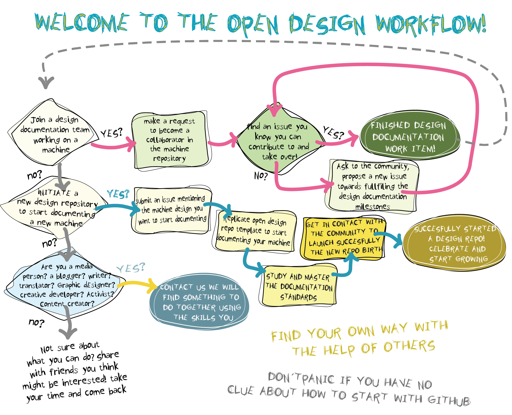

## 1. Join a design and documentation team working on a machine.

If you want to learn open design this is the best place to start. If you want to learn or get skilled in a particular area like CAD modeling, CAD Analysis, Hardware Electronics Design, among many others, this is also the right place to start. We have work items, with different levels of complexity.

### 1.1. Make a request to become a collaborator in the github repo of the machine you are interested in.

1.2 . Find an issue you know you can contribute to and take over!

1.3. You have finished your design documentation piece of work. Make a pull request and get feedback from your peers. This is the last step to finally get your work published, ready to be used and improved by others.

Celebrate and get inspired! Go back to step 1.2 and find a new exciting issue to solve.

What can you do if you don't find an issue Ask to the community, propose a new issue towards fulfilling the design documentation  milestones

### 2. Initiate a new design repository to start documenting a new machine.

.  If you are comfortable and feel you have what it takes to take over the design documentation of a particular machine, this is for you.

. If you feel you need to learn a lot but still you are committed to push forward the documentation of a machine, we will help you to get started. You could also get experience by working with a team, already lifting the champion flag to start a new repo.

. If you are a technically skilled person and want to go to a next level of community and project management, using lean and scrum, this is a good start.

. If you are a good manager, and have experience with open workflows, and community management, and this is how you can better contribute this is also for you.

#### 2.1. submit an issue mentioning the machine design you want to start documenting.

2.2. Replicate open design repo template to start documenting your machine.

2.3. Study and master the open design documentation standards.

Assessing the maturity of a repository, and level of readiness for replication.

Are you a media person? a blogger? writer? translator? graphic designer? creative developer? Activist? content creator?
